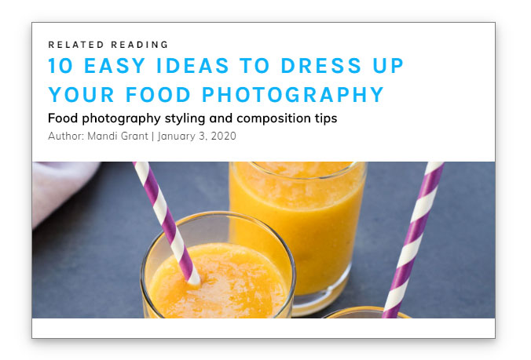
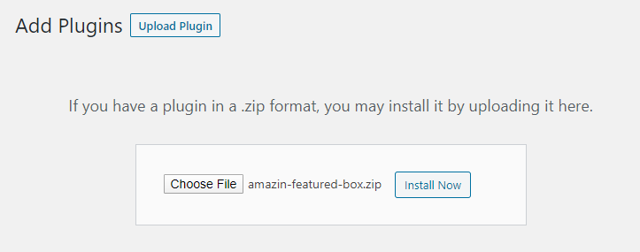
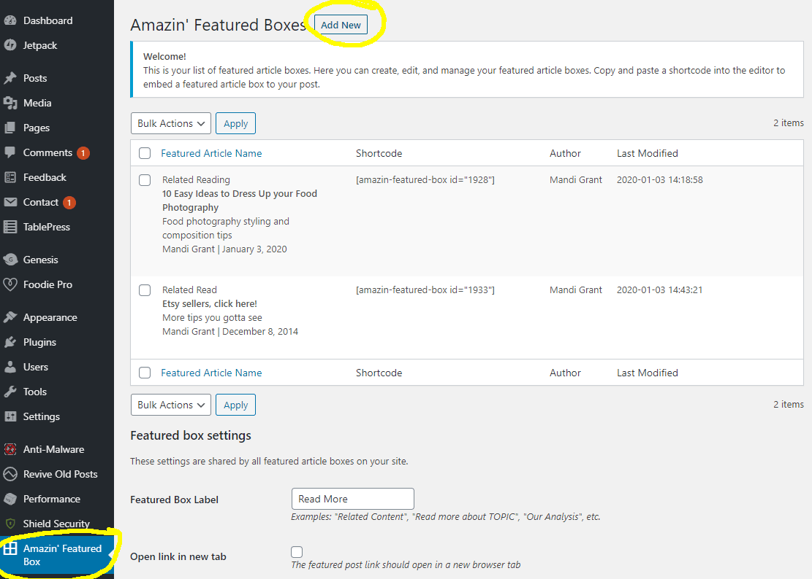
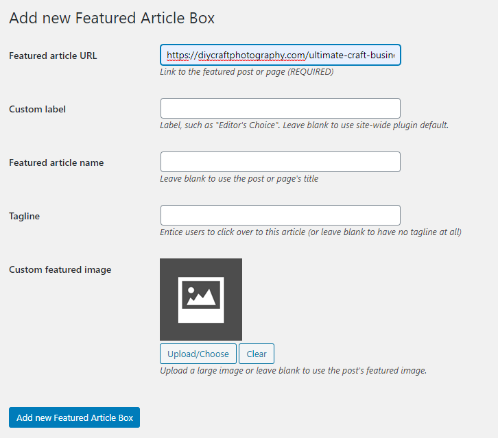
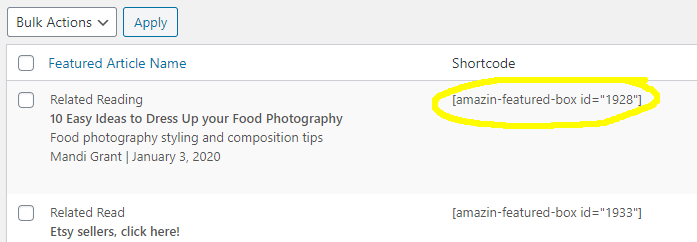

# Amazin' Featured Article Box WordPress Plugin
This simple plugin lets you create and embed eye-catching "featured article" preview boxes into your WP posts using a shortcode. 

## Plugin installation
Download the .zip file from this repo and upload it as a new plugin on your site. Activate the plugin. 

## Creating and managing your "Featured Article" boxes
From the plugins page, navigate to Amazin' Featured Box and click "NEW"

At minimum, you must enter a URL from a page on your blog. 

## Inserting the featured box into a post
On the plugin management page, copy the shortcode for the Featured Article Box you want to embed in a post.

Edit the post and paste that shortcode where you want the box to appear. Save the post and view it: your Featured Article Box should now be in the post. 

## Customizing the plugin's styling
Every template elements of the Amazin' Featured Box has a class you can write custom CSS for. View those classes in your browser's inspector, or peruse this example CSS for help identifying them. Add your custom CSS to your blog's child theme.

Example CSS #1:
https://gist.github.com/MJGrant/2b88077fdb8de8c7c118939cfed99a52
